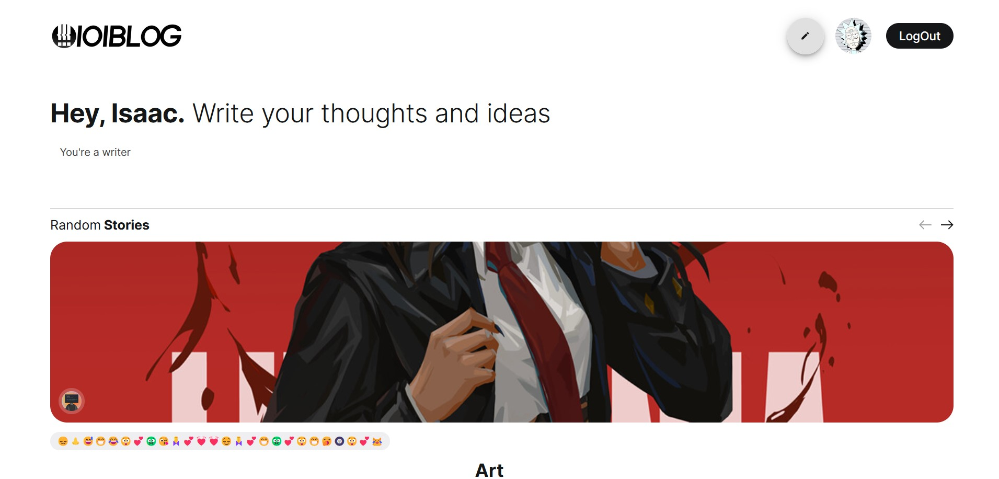
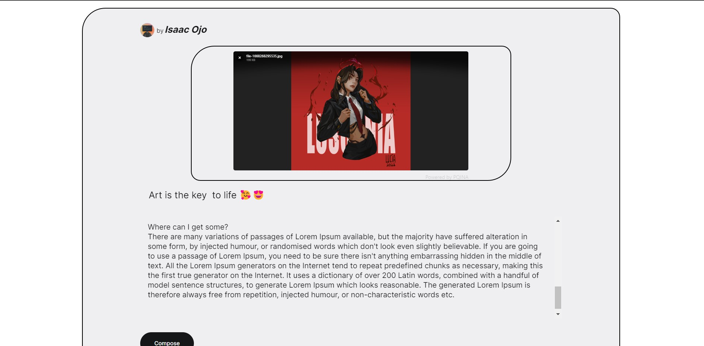
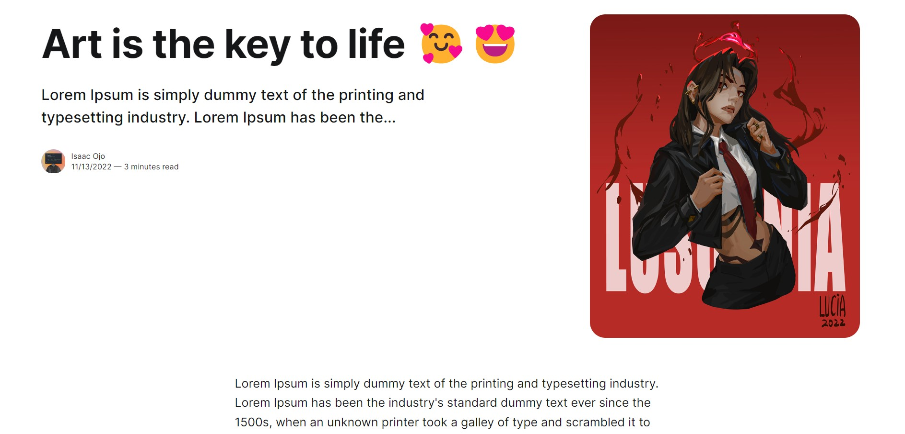
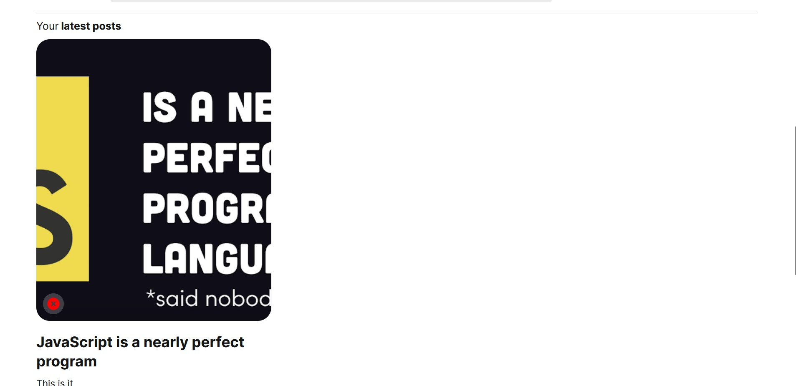
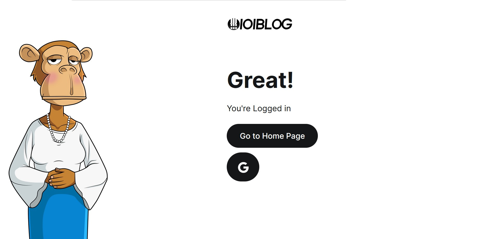

# Blog(Full Stack) - MongoDB + Express + React + Node.js

## Home Page

## Compose Page

## Posts Page

## Latest Posts Page

## Login Page

## Features

- [x] Login With Google
- [x] Create Blog Post with Images
- [x] View BlogPost
- [x] View Individual Author Blog Post
- [x] Beautiful UI
- [x] MutiPage
- [x] AuthorPage

## Todo

- [ ] Refractor Code
- [ ] Clean Up code
- [ ] Increase Security
- [ ] Rewrite the Back-end in TypeScript

## Stack

MERN - Mono DB + Express + React + Node.Js

## How to RUN Locally

1. git clone directory
2. npm run install
3. Create the .env File with the following content:
   MONGO_URI=your_mongo_uri
   TOKENFORBLOG= RANDOM STRINGS OF CHARACTERS // This is the token you will use to post a blog {it makes sure that only you can post a blog}
   API_KEY from google
   CLIENT_ID FROM GOOGLE AUTH
4. npm run start-backend && npm run start-client.

## How to Deploy ?

1. cd into client and npm run build
2. copy contents of build folder to the public folder in root directory.
